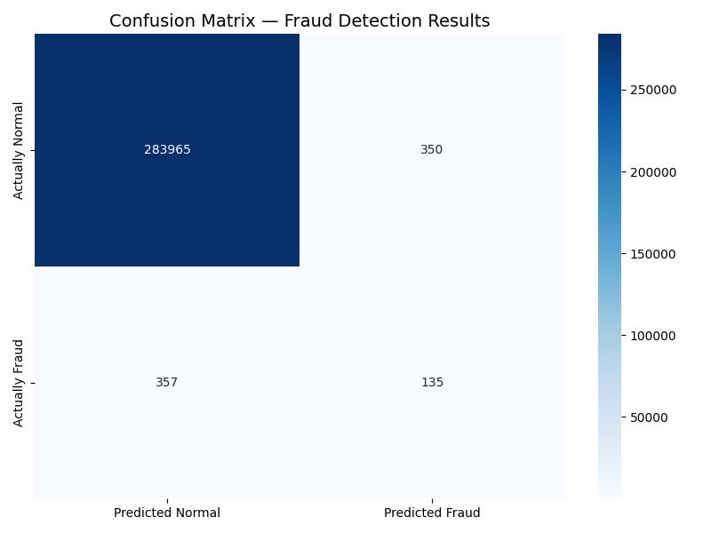

# 🔍 Financial Fraud Detector

An unsupervised Machine Learning project that detects 
suspicious financial transactions using Isolation Forest 
and explains predictions using SHAP values.

---

## 🎯 Project Overview

Credit card fraud costs billions of dollars globally every year.
This project tackles a real-world problem:

> **Can a machine learn what "normal" looks like — and 
> automatically flag transactions that don't fit?**

Using a dataset of 284,807 real anonymized credit card 
transactions, this project builds an anomaly detection 
system that identifies suspicious activity **without being 
told which transactions are fraud** (unsupervised learning).

This project extends the research direction from my first 
project (Financial Data Predictor) by addressing a key gap 
identified in financial ML literature — the need for 
**explainable and interpretable AI** in financial systems.

---

## 📊 Dataset

- **Source:** Credit Card Fraud Detection — Kaggle (ULB)
- **Size:** 284,807 transactions
- **Fraud cases:** 492 (0.1727% of total)
- **Features:** 28 anonymized PCA components (V1-V28) + Time + Amount
- **Download:** kaggle.com/datasets/mlg-ulb/creditcardfraud

> Note: Dataset not included in repo due to size (150MB).
> Download from Kaggle and place creditcard.csv in project root.

---

## 🔬 Key Research Finding

This project confirmed a well-documented challenge in 
financial ML research:

> **The Imbalanced Dataset Problem**

With only 0.17% fraud transactions, standard accuracy 
metrics are misleading — a model predicting "everything 
is normal" achieves 99.83% accuracy while catching 
zero fraud cases.

This finding motivates the exploration of techniques 
like SMOTE (Synthetic Minority Oversampling) to balance 
the dataset and improve fraud detection performance.

---

## 📉 Results

### Isolation Forest (Unsupervised — No Labels Used)

| Metric | Score |
|---|---|
| Precision | 27.8% |
| Recall | 27.4% |
| F1 Score | 27.6% |
| Real fraud caught | 135 out of 492 |
| Innocent transactions flagged | 350 out of 284,315 |

### Confusion Matrix



> These results are expected for unsupervised anomaly 
> detection on highly imbalanced data. The model caught 
> 135 fraud cases with zero prior knowledge of what 
> fraud looks like — motivating supervised approaches.

---

## 🛠️ Tech Stack

- **Python** — Core programming language
- **Pandas** — Data loading and cleaning
- **Scikit-learn** — Isolation Forest model
- **Matplotlib & Seaborn** — Visualization
- **SHAP** — Explainability analysis (coming soon)

---

## 📁 Project Structure

- fraud_detector.py — Main ML pipeline
- confusion_matrix.png — Model evaluation visualization
- .gitignore — Excludes large CSV file
- README.md — Project documentation

---

## 🚀 How to Run

**1. Clone the repository**
```bash
git clone https://github.com/Muhammadfaisal39/financial-fraud-detector
cd financial-fraud-detector
```

**2. Install dependencies**
```bash
pip install pandas scikit-learn matplotlib seaborn shap
```

**3. Download dataset**

Download creditcard.csv from Kaggle and place in project root.

**4. Run the detector**
```bash
python fraud_detector.py
```

---

## 🔮 Next Steps

- Apply SMOTE to fix the imbalanced dataset problem
- Retrain with balanced data and compare results
- Add SHAP explainability — show WHY each 
  transaction was flagged
- Build a complete research summary document

---

## 🔗 Related Project

This is Project 2 in my Financial ML portfolio.

**Project 1:** Financial Data Predictor
github.com/Muhammadfaisal39/financial-data-predictor
- Predicts Apple stock prices using Linear Regression 
  and Random Forest (99.84% R2 score)
- Includes SHAP explainability analysis

---

## 👨‍💻 About the Author

**Muhammad Faisal**
CS Graduate | ML Researcher | Software Engineer

- 🎓 CGPA: 3.87/4.0 — Hazara University Mansehra
- 📝 Presented ML research at HEC National Conference 2023
- 🏆 IBM Machine Learning with Python — Coursera 2026
- 💼 linkedin.com/in/muhammadfaisal39
- 🐙 github.com/Muhammadfaisal39

---

⭐ If you found this project useful, please give it a star!  
